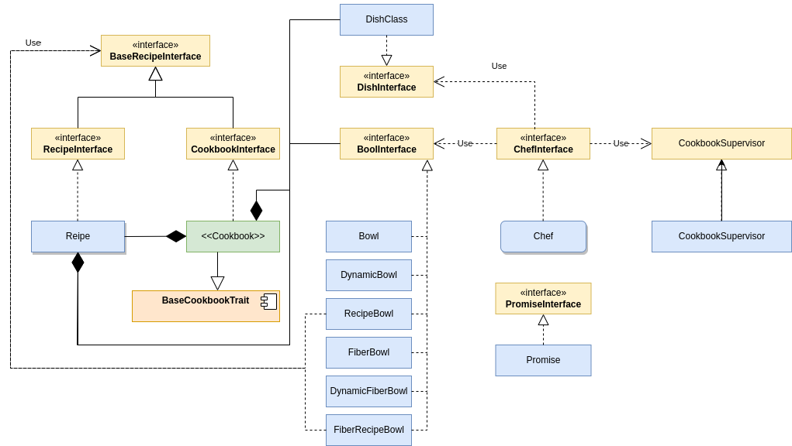
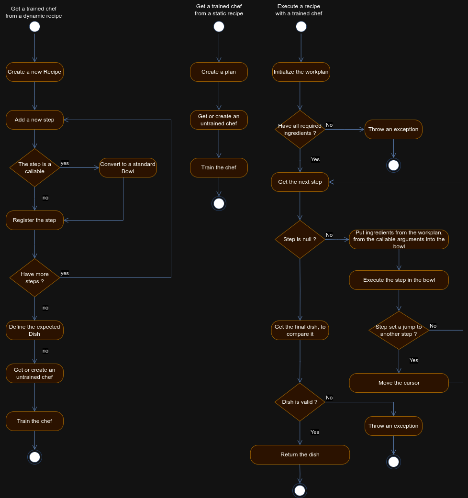

Teknoo Software - Recipe library
================================

Introduction
------------
Inspired by cooking, allows the creation of dynamic algorithm, called here recipe,
following the #east programming and using middleware, configurable via DI or any configuration,
if a set of conditions (ingredients) are available.

Architecture
------------
This library is built around two majors components : `Recipe` and `Chef`.

A `Recipe` is a dynamic algorithm, written at runtime, with :
* a list of required ingredients at startup (`require()`).
* an ordered list of steps, each step must be named (`cook()`, or `execute()` for a sub recipe).
  * Each step has a position (an integer). Without explicit position, a step is appended after the last one.
  * Several steps can share a same position : they are executed in their order of definition.
  * A step can also be inserted relatively to another step, with `RecipeRelativePositionEnum::Before` or `After`
    and the name of this other step (`$offsetStepName`). If the other step does not exist, the step is appended
    at the end.
  * A step defined several times with the same name is suffixed with a counter (`step`, `step1`, `step2`...).
* some error handlers (`onError()`), called with the exception (available in the workplan under the key
  `exception`) when a step throws or calls `ChefInterface::error()`.
* an expected dish (`given()`), checked when a step calls `ChefInterface::finish($result)`.

`Recipe` is an immutable stated class : each call to `require()`, `cook()`, `execute()`, `onError()` or `given()`
returns a **new** `Recipe` instance, the original `Recipe` stays unchanged. Always use the returned instance.
States are :
* `Draft` : the recipe can be completed with new ingredients, steps, handlers or dish.
* `Written` : the recipe has been compiled to train a `Chef`. `train()` compiles a clone of the recipe, so the
  instance you keep in your code stays a `Draft`.

A `Recipe` can accept another `Recipe`, or a `Plan`, as step (`execute()`). This second `Recipe` will be called a
subrecipe, it is executed by a new sub chef, with a copy of the workplan of the main chef (both workplans then
evolve independently). A sub recipe can be repeated several times, either by defining a fixed integer, or via a
callback : this callback receives the ingredients `counter` (the number of executions already done) and `bowl`
(the `RecipeBowl` instance) and must call `$bowl->stopLooping()` to stop the loop. A sub recipe can also be
executed in a `Fiber` (`inFiber: true`).

A step may not be defined at the time of creation of the recipe but at the time of its execution,
from an ingredient of the work plan (`DynamicBowl` and `DynamicFiberBowl`, see the security note below).

A `Plan` is an alternative to `Recipe` to hardcode some steps and allow developer to "type" easily a `Recipe` in a
container. `Recipe` and `Plan` implement `BaseRecipeInterface`. A plan built with `BasePlanTrait` populates its
recipe in `populateRecipe()`, can be filled with a prefilled recipe (`fill()`) and can add default ingredients to
the workplan (`addToWorkplan()`, the plan itself is available under the key `PlanInterface::class`). An editable
plan (`EditablePlanTrait`) accepts additional steps (`add()`, with a `Plan\Step` to define a mapping) and error
handlers (`addErrorHandler()`) after its definition, for example from a decorated service in a container.

The `Chef` is the executor, it is a mutable stated class. States are :
* `Free`. The initial state, when the `Chef` is not trained
* `Trained`. When the `Chef` has read a recipe (or a plan). It cannot rollback to `Free`.
* `Cooking`. When a `Chef` executes a `Recipe`. It cannot execute several `Recipe` in same time, but it can reserve
  an execution to switch to a subrecipe. When the recipe is finished (or when an exception escapes from it), the
  workplan is cleaned and the object rollbacks to `Trained`. A chef can be reused for several cookings.

The workplan is the list of ingredients (`name => value`) available during a cooking : the initial values passed
to `process()`, the required ingredients (checked and normalized before the cooking), and the values added by the
steps with `continue()`, `updateWorkPlan()` or `merge()` (for `MergeableInterface` values). A `null` value is
considered as absent.

Each step is executed into a `BowlInterface`. A Bowl is an object, able to extract required ingredients defined as
arguments of the step's callable, from the current workplan. And runs ingredient transformation when they are defined
(like transform an `ArrayObject` to an `array`).
Ingredients are selected, in order :
* Type hinting of a special value (`ChefInterface`, `CookingSupervisorInterface` and `Fiber`)
* The mapping passed to `cook()` : another ingredient name, a list of names (the first available is used), or a
  fixed value with `Value`
* Name hinting (the parameter's name as key of the workplan)
* The parameter's class as key of the workplan
* Type hinting (an instance of the parameter's type in the workplan, including a `TransformableInterface` instance
  of the class defined in the `#[Transform]` attribute)
* Special value (`_methodName` to get the name of the step)
* The default value of the parameter. A mandatory parameter without value throws a `BadMethodCallException`.

An ingredient can be transformed before its injection into the step with the attribute `#[Transform]` on the
parameter : `TransformableInterface::transform()` is called on the value, and/or a transformer callable can be
defined (any callable allowed in an attribute : a function name or an array `[Class::class, 'method']`, and also
a first-class callable like `MyTransformer::toDateTime(...)` since PHP 8.5) :

    public static function myStep(
        #[Transform(transformer: [MyTransformer::class, 'toDateTime'])] DateTime $date,
        ChefInterface $chef,
    ): void {
        // ...
    }

When the Bowl is a Fiber Bowl (`FiberBowl`, `DynamicFiberBowl`, or a sub recipe with `inFiber: true`), the step is
executed in a new fiber, registered into the `CookingSupervisor` instance of the chef. The chef never resumes the
fibers itself : a step (with a `CookingSupervisorInterface $supervisor` parameter) must drive the supervisor with
`switch()` (resume the next suspended fiber), `loop()` (resume each fiber once), `finish()` (loop until all fibers
are terminated) or `throw()` (resume the next fiber with an exception). Fibers are resumed in the order of their
registration.

**Security note** : `DynamicBowl` and `DynamicFiberBowl` execute a callable read from the workplan, and an
ingredient required with a class accepts a class name as string value. Never map these keys to values controlled
by an end user (like request parameters).

Workflow
--------

Examples
--------
* [Simple recipe](../demo/simple_recipe.php)
* [A dynamic step in a recipe](../demo/dynamic_recipe.php)
* [Simple recipe with sub recipe](../demo/simple_sub_recipe.php)
* [How create a recipe with a repeated step or sub recipe](../demo/repeat_sub_recipe.php)
* [How merge or transform some ingredients before a step](../demo/merge_and_transform_ingredient.php)

Credits
-------
EIRL Richard Déloge - <https://deloge.io> - Lead developer.
SASU Teknoo Software - <https://teknoo.software>

About Teknoo Software
---------------------
**Teknoo Software** is a PHP software editor, founded by Richard Déloge, as part of EIRL Richard Déloge.
Teknoo Software's goals : Provide to our partners and to the community a set of high quality services or software,
sharing knowledge and skills.

License
-------
Recipe is licensed under the 3-Clause BSD License - see the [LICENSE](../LICENSE) file for details.
