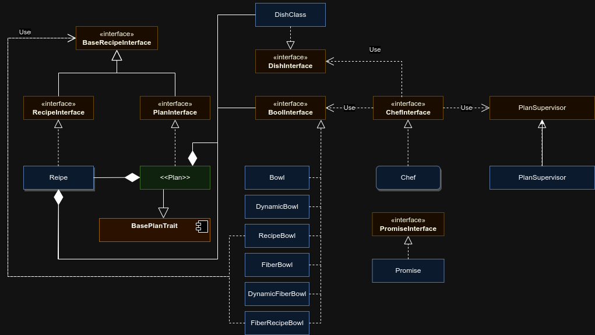

Teknoo Software - Recipe library
================================

Introduction
------------
Inspired by cooking, allows the creation of dynamic algorithm, called here recipe,
following the #east programming and using middleware, configurable via DI or any configuration,
if a set of conditions (ingredients) are available.

Architecture
------------
This library is built around two majors components : `Recipe` and `Chef`.

A `Recipe` is a dynamic algorithm, written at runtime, with : 
* a list of required ingredients at startup.
* an ordered list of steps, each step must be named.
  * Several steps can share a same position in the list. These steps must be called in a random order and in parallel.
* an expected dish.

`Recipe` is an immutable stated class. States are :
* `Draft` until the recipe is not read by a `Chef`.
* `Written` when the recipe was read by at least one `Chef`.

At each new added step, required ingredient or dish, a cloned `Recipe` is returned. The original `Recipe` stay unchanged

A `Recipe` can accept another `Recipe` as step. This second `Recipe` will be called a subrecipe.

A step may not be defined at the time of creation of the recipe but at the time of its execution, 
from an ingredient of the work plan.

A step can be repeated several times, either by defining a fixed integer, or via a callback.

A `Plan` is an alternative to `Recipe` to hardcoded some step and allow developer to "type" easily a `Recipe` in a 
container. `Recipe` and `Plan` implements `BaseRecipeInterface`.

The `Chef` is the executor, it is a mutable stated class. States are :
* `Free`. The initial state, when the `Chef` is not trained
* `Trained`. When the `Chef` has read a recipe. It cannot rollback to `Free`.
* `Cooking`. When a `Chef` execute a `Recipe`. It cannot execute several `Recipe` in same time, but it can reserve
  an execution to switch to a subrecipe. When the recipe is finished, the object rollabck to `Trained`.

Each step is executed into a `BowlInterface`. A Bowl is an object, able to extract required ingredients defined as
arguments of the step's callable, from the current workplan. And runs ingredient transformation when they are defined
(like transform an `ArrayObject` to an `array`).
Ingredients are selected, in order :
* Type hitting of a special value (`ChefInterface`, `CookingSupervisorInterface` and `Fiber`)
* Name hitting
* Type hitting
* Special value (`_methodName` to get the name of the step)

When the Bowl is a Fiber Bowl, it will be executed in a new fiber, supervised by a `CookingSupervisor` instance 

Workflow
--------

Examples
--------
* [Simple recipe](../demo/dynamic_recipe.php)
* [A dynamic step in a recipe](../demo/dynamic_recipe.php)
* [Simple recipe with sub recipe](../demo/simple_sub_recipe.php)
* [How create a recipe with a repeated step or sub recipe](../demo/repeat_sub_recipe.php)
* [How merge or transform some ingredients before a step](../demo/merge_and_transform_ingredient.php)

Credits
-------
EIRL Richard Déloge - <https://deloge.io> - Lead developer.
SASU Teknoo Software - <https://teknoo.software>

About Teknoo Software
---------------------
**Teknoo Software** is a PHP software editor, founded by Richard Déloge, as part of EIRL Richard Déloge.
Teknoo Software's goals : Provide to our partners and to the community a set of high quality services or software,
sharing knowledge and skills.

License
-------
Recipe is licensed under the MIT License - see the licenses folder for details.
